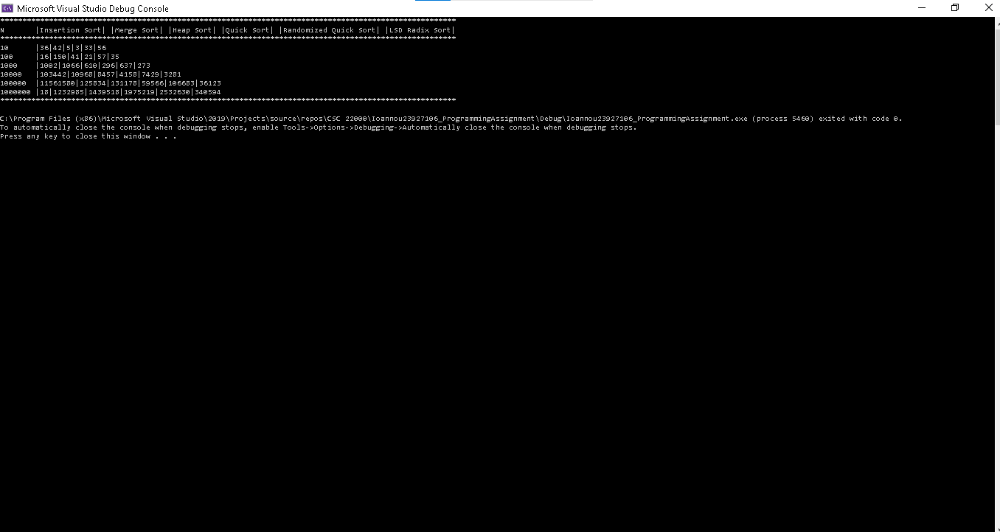
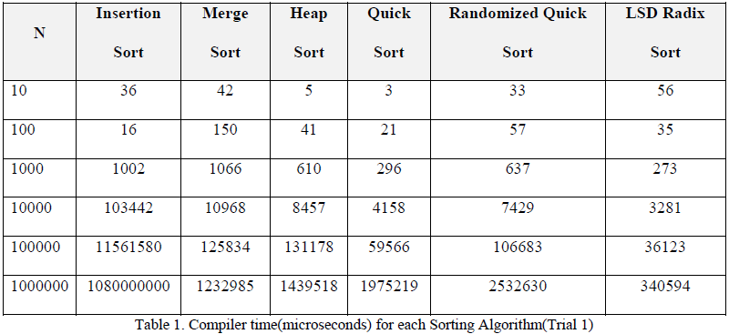
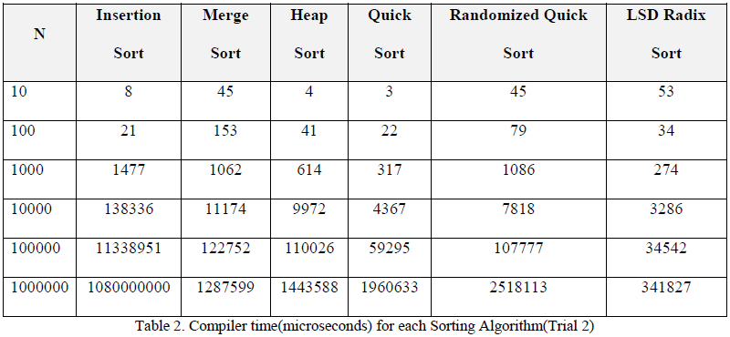
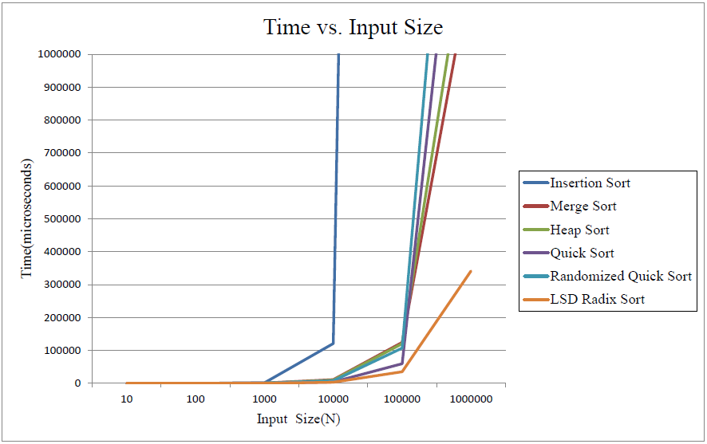

# Reporting and analyzing the compiler time of six Sorting Algorithms
<a name="readme-top"></a>

[![Contributors][contributors-shield]][contributors-url]
[![Forks][forks-shield]][forks-url]
[![Stargazers][stars-shield]][stars-url]
[![Issues][issues-shield]][issues-url]
[![MIT License][license-shield]][license-url]
[![LinkedIn][linkedin-shield]][linkedin-url]
[![GitHub][github-shield]][github-url]

<br />
<div align="center">
  

<h3 align="center"><a href="https://github.com/GeorgiosIoannouCoder/sorting-algorithms/blob/main/Ioannou_Report.pdf">Reporting and analyzing the compiler time of six Sorting Algorithms</a></h3>

  <p align="center">
    In this programming assignment, I investigated the compiler time of <b>six different Sorting Algorithms</b> for different input sizes. The six Sorting Algorithms analyzed in this report are: <b>Insertion Sort, Merge Sort, Heap Sort, Quick Sort, Randomized Quick Sort, and LSD Radix Sort</b>. A code that was built from scratch was used to generate random arrays of different sizes from 10 to 1000000 an excessively test each Sorting Algorithm. The code is based on the pseudocodes found in the textbook: <b>"Introduction to Algorithms, THIRD EDITION"</b> by Cormen Leiserson,Rivest, and Stein and published by The MIT Press. The program was repeated twice and the average compiler time was reported.
    <br />
    <a href="https://github.com/GeorgiosIoannouCoder/sorting-algorithms"><strong>Explore the docs »</strong></a>
    <br />
    <br />
    <a href="https://github.com/GeorgiosIoannouCoder/sorting-algorithms/issues">Report Bug</a>
    ·
    <a href="https://github.com/GeorgiosIoannouCoder/sorting-algorithms/issues">Request Feature</a>
  </p>
</div>

<details>
  <summary>Table of Contents</summary>
  <ol>
    <li>
      <a href="#about-the-project">About The Project</a>
      <ul>
        <li><a href="#sorting-algorithms">Sorting Algorithms</a></li>
        <li><a href="#key-feature">Key Feature</a></li>
        <li><a href="#built-with">Built With</a></li>
      </ul>
    </li>
    <li>
      <a href="#getting-started">Getting Started</a>
      <ul>
        <li><a href="#prerequisites">Prerequisites</a></li>
        <li><a href="#installation">Installation</a></li>
      </ul>
    </li>
    <li><a href="#code">Code</a></li>
    <li><a href="#output">Output</a></li>
    <li><a href="#report">Report</a></li>
    <li><a href="#analysis">Analysis</a></li>
    <li><a href="#contributing">Contributing</a></li>
    <li><a href="#license">License</a></li>
    <li><a href="#contact">Contact</a></li>
  </ol>
</details>

## About The Project


### Sorting Algorithms


<p align="right"><a href="#readme-top">Back to top</a></p>


### Key Feature

1. **Excessively test each Sorting Algorithm with random arrays of different sizes from 10 to 1000000.**

<p align="right"><a href="#readme-top">Back to top</a></p>

### Built With

[![C++][C++]][C++-url]
[![VisualStudio][VisualStudio]][VisualStudio-url]
[![Excel][Excel]][Excel-url]
[![Git][Git]][Git-url]

<p align="right"><a href="#readme-top">Back to top</a></p>

## Getting Started

**To get a local copy of this project up and running locally follow these simple example steps:**

### Prerequisites

**NOTE:** How to check if Git is installed and what is its version

```sh
  git -v
```

1. Please make sure you have git installed

   - Windows: [https://git-scm.com/download/win](https://git-scm.com/download/win)
   - Mac: [https://git-scm.com/download/mac](https://git-scm.com/download/mac)
   - Linux: [https://git-scm.com/download/linux](https://git-scm.com/download/linux)

2. Please make sure you have Visual Studio or Visual Studio Code with the C/C++ extension installed. You can download Visual Studio [here](https://visualstudio.microsoft.com/downloads/). You can download Visual Studio Code [here](https://code.visualstudio.com/download).

***NOTE: You can use whatever code editor that you want. This project was created and tested with Visual Studio.***

### Installation

#### SetUp

1. Navigate to the directory where you want to clone/run/save the application

    ```sh
    cd your_selected_directory
    ```

2. Clone this repository

   ```sh
   git clone https://github.com/GeorgiosIoannouCoder/sorting-algorithms.git
   ```

3. Navigate to the sorting-algorithms git repository

   ```sh
   cd sorting-algorithms
   ```

4. Open your code editor.

   ```sh
   code .
   ```

5. Run the .cpp file [here](https://github.com/GeorgiosIoannouCoder/sorting-algorithms/blob/main/Ioannou_Sorting_Algorithms.cpp).
   
<p align="right"><a href="#readme-top">Back to top</a></p>

## Code

The main code file can be found [here](https://github.com/GeorgiosIoannouCoder/sorting-algorithms/blob/main/Ioannou_Sorting_Algorithms.cpp).

<p align="right"><a href="#readme-top">Back to top</a></p>

## Output

The code of this project produces an output similiar to this:



<p align="right"><a href="#readme-top">Back to top</a></p>

## Report

The report of this project is located [here](https://github.com/GeorgiosIoannouCoder/sorting-algorithms/blob/main/Ioannou_Report.pdf). The tables and graph found inside the Report are loacted [here](https://github.com/GeorgiosIoannouCoder/sorting-algorithms/blob/main/Tables.xlsx).

<p align="right"><a href="#readme-top">Back to top</a></p>

## Analysis

As I stated in my hypothesis in the [Report](https://github.com/GeorgiosIoannouCoder/sorting-algorithms/blob/main/Ioannou_Report.pdf) and by studying Table 3 and Figure 1, the **slowest Sorting Algorithm is Insertion Sort** and the **fastest Sorting Algorithm is LSD Radix Sort** among these six Algorithms. I was also correct that Quick Sort beats Heap Sort which beats Merge Sort. **However, Randomized Quick Sort (picking random pivot) is not faster than Quick Sort (picking the last element as the pivot)**. In fact, Randomized Quick Sort is sometimes slower than Heap Sort such as in the case when the input size is N=1000000. However, as the table shows, **Insertion Sort even though it is a quadratic Sorting Algorithm it is faster than Merge Sort, Randomized Quick Sort, and LSD Radix Sort for small array sizes and nearly sorted arrays**. Insertion Sort starts to be slow when the input size N gets larger.








<p align="right"><a href="#readme-top">Back to top</a></p>

## Contributing

Contributions are what make the open source community such an amazing place to learn, inspire, and create. Any contributions you make are **greatly appreciated**.

If you have a suggestion that would make this better, please fork the repo and create a pull request. You can also simply open an issue with the tag "enhancement".
Don't forget to give the project a star! Thanks again!

1. Fork the Project
2. Create your Feature Branch (`git checkout -b feature/AmazingFeature`)
3. Commit your Changes (`git commit -m 'Add some AmazingFeature'`)
4. Push to the Branch (`git push origin feature/AmazingFeature`)
5. Open a Pull Request

<p align="right"><a href="#readme-top">Back to top</a></p>

## License

Distributed under the MIT License. See [LICENSE](https://github.com/GeorgiosIoannouCoder/sorting-algorithms/blob/master/LICENSE) for more information.

MIT License

Copyright (c) 2021 Georgios Ioannou

Permission is hereby granted, free of charge, to any person obtaining a copy
of this software and associated documentation files (the "Software"), to deal
in the Software without restriction, including without limitation the rights
to use, copy, modify, merge, publish, distribute, sublicense, and/or sell
copies of the Software, and to permit persons to whom the Software is
furnished to do so, subject to the following conditions:

The above copyright notice and this permission notice shall be included in all
copies or substantial portions of the Software.

THE SOFTWARE IS PROVIDED "AS IS", WITHOUT WARRANTY OF ANY KIND, EXPRESS OR
IMPLIED, INCLUDING BUT NOT LIMITED TO THE WARRANTIES OF MERCHANTABILITY,
FITNESS FOR A PARTICULAR PURPOSE AND NONINFRINGEMENT. IN NO EVENT SHALL THE
AUTHORS OR COPYRIGHT HOLDERS BE LIABLE FOR ANY CLAIM, DAMAGES OR OTHER
LIABILITY, WHETHER IN AN ACTION OF CONTRACT, TORT OR OTHERWISE, ARISING FROM,
OUT OF OR IN CONNECTION WITH THE SOFTWARE OR THE USE OR OTHER DEALINGS IN THE
SOFTWARE.

<p align="right"><a href="#readme-top">Back to top</a></p>

## Contact

Georgios Ioannou - [@LinkedIn](https://linkedin.com/in/georgiosioannoucoder)

Georgios Ioannou - [@georgiosioannoucoder](https://georgiosioannoucoder.github.io/) - Please contact me via the form in my portfolio.

Project Link: [https://github.com/GeorgiosIoannouCoder/sorting-algorithms](https://github.com/GeorgiosIoannouCoder/sorting-algorithms)

<p align="right"><a href="#readme-top">Back to top</a></p>

[contributors-shield]: https://img.shields.io/github/contributors/GeorgiosIoannouCoder/sorting-algorithms.svg?style=for-the-badge
[contributors-url]: https://github.com/GeorgiosIoannouCoder/sorting-algorithms/graphs/contributors

[forks-shield]: https://img.shields.io/github/forks/GeorgiosIoannouCoder/sorting-algorithms.svg?style=for-the-badge
[forks-url]: https://github.com/GeorgiosIoannouCoder/sorting-algorithms/network/members

[stars-shield]: https://img.shields.io/github/stars/GeorgiosIoannouCoder/sorting-algorithms.svg?style=for-the-badge
[stars-url]: https://github.com/GeorgiosIoannouCoder/sorting-algorithms/stargazers

[issues-shield]: https://img.shields.io/github/issues/GeorgiosIoannouCoder/sorting-algorithms.svg?style=for-the-badge
[issues-url]: https://github.com/GeorgiosIoannouCoder/sorting-algorithms/issues

[license-shield]: https://img.shields.io/github/license/GeorgiosIoannouCoder/sorting-algorithms.svg?style=for-the-badge
[license-url]: https://github.com/GeorgiosIoannouCoder/sorting-algorithms/blob/master/LICENSE

[linkedin-shield]: https://img.shields.io/badge/-LinkedIn-black.svg?style=for-the-badge&logo=linkedin&colorB=0077B5
[linkedin-url]: https://linkedin.com/in/georgiosioannoucoder

[github-shield]: https://img.shields.io/badge/-GitHub-black.svg?style=for-the-badge&logo=github&colorB=000
[github-url]: https://github.com/GeorgiosIoannouCoder/

[C++]: https://img.shields.io/badge/c++-d5e4f3?style=for-the-badge&logo=cplusplus&logoColor=044f88
[C++-url]: https://cplusplus.com/

[VisualStudio]: https://img.shields.io/badge/visual%20studio-5d2b90?style=for-the-badge&logo=visualstudio&logoColor=ffffff
[VisualStudio-url]: https://visualstudio.microsoft.com/

[Excel]: https://img.shields.io/badge/microsoft%20excel-1d6f42?style=for-the-badge&logo=microsoft
[Excel-url]: https://www.microsoft.com/en-us/microsoft-365

[Git]: https://img.shields.io/badge/git-000000?style=for-the-badge&logo=git&logoColor=orange
[Git-url]: https://git-scm.com/
